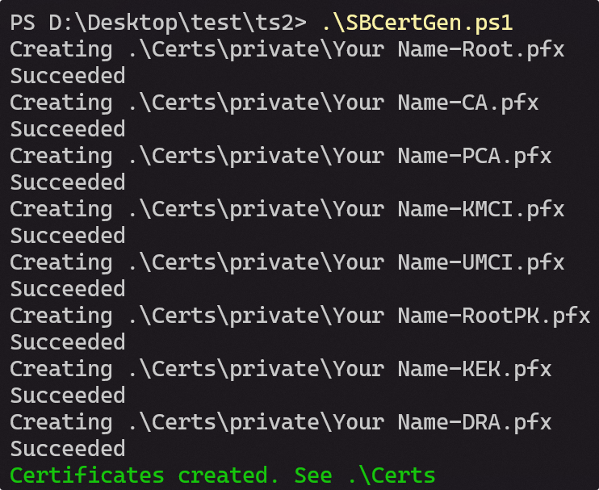
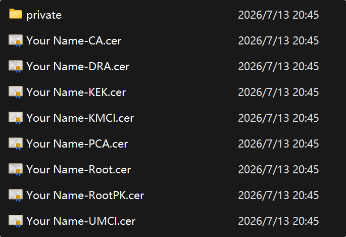

<!-- Part of this page is AGC -->
# Secure Boot
Secure Boot in this section is "UEFI Secure Boot". It's different from soc's secboot.

## Enable SecureBoot
Compile uefi with `-s 1`.

## Replace Certs
Aloha uefi uses our own certs by default. It's private and will not be shared with anyone so it's secure enough. However, if you want your uefi to run executable binaries signed by yourself, this section may help.

### Generate Key Pairs
This script can help you generate certs. Replace the Path, Name, and E-mail in the script with your own before running.
- <a href="/Security/SecureBoot/SBCertGen.ps1" download>SBCertGen.ps1</a>
- <a href="/Security/SecureBoot/SbCertGen.sh" download>SBCertGen.sh</a>



After generating, you can find the key pairs under the **Certs** folder.


### Replace Keys in uefi
Clone our uefi source and this repo:
```bash
git clone https://github.com/project-aloha/mu_aloha_platforms --depth=1
git clone https://github.com/microsoft/secureboot_objects/ --depth=1
```

Replace `WOAMSMNILE-KEK.der` and `WOAMSMNILE-PK.der` located at:
```
Platforms/AndromedaPkg/Include/Resources/SecureBoot/keystore/
```
then edit `keystore/keystore.toml` at the same folder to reference them.

::: tip
The RootPK and KEK generated by the script end with `.cer` and are already in X509 DER format. Just rename the suffix to `.der`.
:::

### Generate secure objects

Install python dependencies and run the build script in secure boot objects:
```bash
# Create venv and install dependencies
cd secureboot_objects
python3 -m venv .venv
source .venv/bin/activate
pip install -r pip-requirements.txt

# Generate EFI Signature Lists
cd ../mu_aloha_platforms/Platforms/AndromedaPkg/Include/Resources/SecureBoot

python3 ../../../../../../secureboot_objects/scripts/secure_boot_default_keys.py \
  --keystore keystore/keystore.toml \
  -o Artifacts
```

Output BIN files are generated under `Artifacts/Aarch64/keystore/Firmware`. Ignore bins under `Artifacts/Aarch64/keystore/Imaging/`, they are not used here.

### Convert BIN to DSC PCDs
Run the following script under `mu_aloha_platforms/Platforms/AndromedaPkg/Include/Resources/SecureBoot/`. It uses `MU_BASECORE` (checked out as a submodule of `mu_aloha_platforms`) to locate `BinToPcd.py`, and generates `SecureBootKeys.dsc.inc` in the current folder.

::: tip
`MU_BASECORE` is a submodule. You must run `build_uefi.py -i` for at least 1 time or clone uefi repo with `--recursive` before using script below.
:::

```bash
SCRIPTS=../../../../../MU_BASECORE/BaseTools/Scripts
BIN_DIR=Artifacts/Aarch64/keystore/Firmware/
OUT=/tmp

python3 $SCRIPTS/BinToPcd.py -i $BIN_DIR/DefaultPk.bin    -o $OUT/pk.inc   -p gMsCorePkgTokenSpaceGuid.PcdDefaultPk
python3 $SCRIPTS/BinToPcd.py -i $BIN_DIR/DefaultDb.bin    -o $OUT/db.inc   -p gMsCorePkgTokenSpaceGuid.PcdDefaultDb
python3 $SCRIPTS/BinToPcd.py -i $BIN_DIR/Default3PDb.bin  -o $OUT/3pdb.inc -p gMsCorePkgTokenSpaceGuid.PcdDefault3PDb
python3 $SCRIPTS/BinToPcd.py -i $BIN_DIR/DefaultDbx.bin   -o $OUT/dbx.inc  -p gMsCorePkgTokenSpaceGuid.PcdDefaultDbx
python3 $SCRIPTS/BinToPcd.py -i $BIN_DIR/DefaultKek.bin   -o $OUT/kek.inc  -p gMsCorePkgTokenSpaceGuid.PcdDefaultKek

# Merge all fragments into SecureBootKeys.dsc.inc.
echo "[PcdsFixedAtBuild.common]" > SecureBootKeys.dsc.inc
for f in $OUT/pk.inc $OUT/db.inc $OUT/3pdb.inc $OUT/dbx.inc $OUT/kek.inc; do
  echo "" >> SecureBootKeys.dsc.inc
  cat "$f" >> SecureBootKeys.dsc.inc
done
```

Then, you should check this file and compare with:
```
Platforms/AndromedaPkg/SecureBootKeys.dsc.inc
```
If it looks fine, replace the file under `AndromedaPkg`.

By the way, the file format should look like:
```ini
[PcdsFixedAtBuild.common]

  # The PK
  gMsCorePkgTokenSpaceGuid.PcdDefaultPk|{ 0x.., ... }

  # The DB
  gMsCorePkgTokenSpaceGuid.PcdDefaultDb|{ 0x.., ... }

  # The Third Party DB
  gMsCorePkgTokenSpaceGuid.PcdDefault3PDb|{ 0x.., ... }

  # The DBX
  gMsCorePkgTokenSpaceGuid.PcdDefaultDbx|{ 0x.., ... }

  # The KEK
  gMsCorePkgTokenSpaceGuid.PcdDefaultKek|{ 0x.., ... }
```

### Rebuild & Test
Rebuild uefi with the `-s 1` parameter and boot it on your device. Your device will reject running unsigned bootaa64.efi in this case.

### Important Constraints

- **PK**: Only **one** certificate is supported. If multiple certs are present, UEFI enrollment will fail with `Invalid Parameter`.
- **KEK**: Multiple certificates allowed (Microsoft KEKs + your own KEK + other KEKs).
- **DB**: Multiple certificates allowed. This is what verifies signed EFI binaries at runtime.
- **DBX**: Revocation list of SHA256 hashes. Sourced from Microsoft's `dbx_info_msft_latest.json`.
- **SignatureOwner GUID**: Each cert entry needs a unique GUID. Do **not** reuse Microsoft's GUID (`77fa9abd-...`) for your own certs. Generate a new UUID per cert family.

---

# References
- [Secure Boot on Surface Duo devices with mu_andromeda_platforms](https://github.com/WOA-Project/SurfaceDuo-Guides/blob/main/DeviceSecurity/SecureBoot.md)
